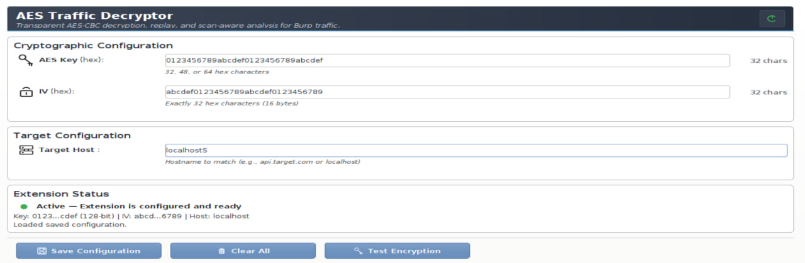
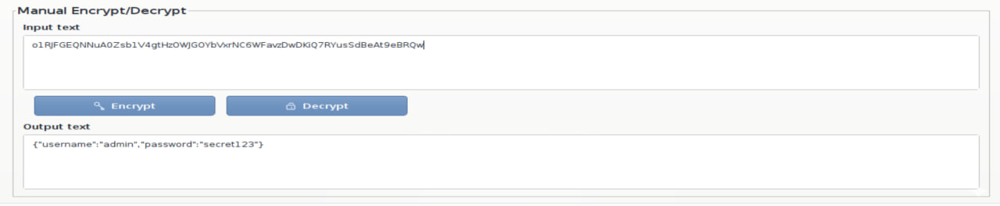
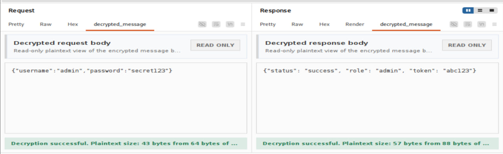

# 🔐 AES Traffic Decryptor — Расширение для Burp Suite

> **Прозрачная расшифровка, повтор и анализ AES-CBC зашифрованного трафика в Burp Suite.**

Расширение для Burp Suite, позволяющее пентестерам прозрачно работать с API, которые шифруют тела запросов и ответов с помощью AES-CBC. Все запросы к целевому хосту автоматически шифруются перед отправкой — независимо от источника (Proxy, Scanner, API Scan, Intruder, Repeater).

---

## 📸 Скриншоты

### 🔧 Вкладка конфигурации (AES Config)


### 🔐 Ручное шифрование/дешифрование (Manual Encrypt/Decrypt)


### 🔓 Вкладка decrypted_message (HTTP History)


---

## 🚀 Возможности

### 🔑 Конфигурация и криптография
- ✅ Ввод AES-ключа (128/192/256 бит) и вектора инициализации (IV)
- ✅ Фильтрация по целевому хосту
- ✅ PKCS5Padding для данных динамической длины
- ✅ Валидация ввода в реальном времени
- ✅ Кнопка «Test Encryption» для проверки ключа/IV
- ✅ Сохранение конфигурации между перезапусками Burp
- ✅ Панель ручного шифрования/дешифрования

### 🖥️ Интеграция с интерфейсом
- ✅ Вкладка `decrypted_message` в HTTP History
- ✅ Вкладка `decrypted_message` в Repeater с редактированием
- ✅ Автоматическое шифрование при нажатии Send
- ✅ Автоматическая расшифровка ответа сервера
- ✅ HTTP Logger с подсветкой трафика

### 🔄 Автоматическое шифрование всех запросов
- ✅ ВСЕ запросы к целевому хосту шифруются автоматически
- ✅ Работает из любого инструмента: Proxy, Scanner, API Scan, Intruder, Repeater
- ✅ Уже зашифрованные запросы не шифруются повторно
- ✅ Невалидный JSON — шифруется как байты (AES шифрует байты, не JSON)
- ✅ Если шифрование невозможно — запрос отправляется в исходном виде

### 🔍 Автоматизация (Active Scan)
- ✅ Точки вставки из расшифрованных тел запросов
- ✅ Извлечение JSON-параметров (строки, числа, boolean)
- ✅ JSON-aware экранирование пейлоадов
- ✅ Расшифровка ответов для анализа уязвимостей
- ✅ Отображение на Dashboard с расшифрованными доказательствами
- ✅ Обнаружение: Reflected Input, SQL-ошибки, Stack Trace
- ✅ Автоматическое восстановление повреждённых запросов сканера

---

## ⚡ Быстрый старт

```bash
# 1. Клонировать
git clone https://github.com/KirolosKhairy/burp-aes-extension.git
cd burp-aes-extension

# 2. Собрать
gradle build

# 3. Загрузить в Burp: Extensions → Add → Java → build/libs/burp-aes-extension.jar

# 4. Запустить тестовый сервер
pip install flask pycryptodomex
cd test-server && python3 server.py

# 5. Настроить расширение (AES Config):
#    Key:  0123456789abcdef0123456789abcdef
#    IV:   abcdef0123456789abcdef0123456789
#    Host: localhost

# 6. Отправить запрос через Burp Proxy — готово!
```

---

## 📥 Установка

### Вариант 1: Скачать JAR *(Рекомендуется)*

1. Скачайте `burp-aes-extension.jar` из **[Releases](https://github.com/KirolosKhairy/burp-aes-extension/releases)**
2. Откройте Burp Suite
3. **Extensions** → **Installed** → **Add**
4. Extension Type: **Java**
5. Выберите скачанный JAR-файл
6. Нажмите **Next**

### Вариант 2: Сборка из исходников

```bash
git clone https://github.com/KirolosKhairy/burp-aes-extension.git
cd burp-aes-extension
gradle build
# JAR: build/libs/burp-aes-extension.jar
```

### 📦 Требования

| Требование | Версия |
|---|---|
| ☕ Java JDK | 11 и выше |
| 🔧 Burp Suite | Community или Professional (2023+) |
| 📦 Gradle | 4.x – 9.x |

---

## ⚙️ Конфигурация

Нажмите на вкладку **«AES Config»** в верхней панели Burp:

| Поле | Формат | Пример |
|---|---|---|
| 🔑 AES Key | Hex-строка (32/48/64 символа) | `0123456789abcdef0123456789abcdef` |
| 🔒 IV | Hex-строка (32 символа) | `abcdef0123456789abcdef0123456789` |
| 🌐 Target Host | Подстрока имени хоста | `api.target.com` |

> 💡 Нажмите **«Test Encryption»** для проверки корректности ключа и IV перед сохранением.

### 🔎 Где найти ключ и IV

| Источник | Метод |
|---|---|
| 🌐 Web-приложение | Анализ исходного кода JavaScript |
| 📱 Мобильное приложение | Реверс-инжиниринг APK/IPA |
| 🔄 Сетевой трафик | Перехват механизма обмена ключами |
| 📄 Конфигурация | Жёстко закодированные значения в файлах |

---

## 🔧 Использование

### 📋 HTTP History
- Отправьте запрос через Burp Proxy
- Вкладка **«decrypted_message»** покажет расшифрованное тело
- Для plaintext запросов отображается: "✓ Auto-encrypted before sending to server"

### ✏️ Repeater
- Вкладка **«decrypted_message»** → редактируйте JSON
- Нажмите **Send** → расширение автоматически зашифрует
- Ответ автоматически расшифруется

### 🔐 Ручное шифрование/дешифрование
- Прокрутите вкладку AES Config вниз
- Панель **«Manual Encrypt/Decrypt»**
- Введите текст → нажмите **Encrypt** или **Decrypt**

### 🔍 Active Scan (Professional Edition)
- Правой кнопкой → **Scan**
- Расширение предоставляет точки вставки из расшифрованного тела
- Результаты на Dashboard с расшифрованными доказательствами

---

## 🖥️ Тестовый сервер

```bash
# Установка
pip install flask pycryptodomex

# Запуск
cd test-server && python3 server.py
# Сервер: http://localhost:8888
```

| Параметр | Значение |
|---|---|
| 🔑 AES Key | `0123456789abcdef0123456789abcdef` |
| 🔒 IV | `abcdef0123456789abcdef0123456789` |
| 🌐 Target Host | `localhost` |

| Метод | Путь | Описание |
|---|---|---|
| `GET` | `/api/health` | ✅ Проверка подключения |
| `POST` | `/api/login` | 🔐 Аутентификация (admin/secret123) |
| `POST` | `/api/profile` | 👤 Профиль с отражённым user_id |

---

## 📁 Структура проекта

```
burp-aes-extension/
├── build.gradle                            # Сборка (Gradle 4.x–9.x)
├── src/main/java/burp/
│   ├── BurpAesExtension.java              # Главный класс
│   ├── CryptoHelper.java                  # AES/CBC/PKCS5Padding
│   ├── ConfigTab.java                     # UI + Manual Encrypt/Decrypt
│   ├── DecryptedMessageTab.java           # Вкладка decrypted_message
│   ├── DecryptedMessageTabFactory.java    # Фабрика вкладок
│   ├── AesScanCheck.java                  # Точки вставки для сканера
│   ├── AesInsertionPoint.java             # Пользовательские точки вставки
│   ├── AesResponseScanCheck.java          # Анализ ответов для Dashboard
│   └── AesHttpLogger.java                # Логгер + авто-шифрование
├── src/test/java/burp/
│   ├── CryptoTest.java                    # 40 крипто-тестов
│   ├── ScannerRepairTest.java             # 15 тестов восстановления
│   └── AutoEncryptTest.java              # Тест авто-шифрования
├── test-server/server.py                  # Тестовый Flask-сервер
└── screenshots/                           # Скриншоты
```

---

## 🔍 Как это работает

```
📝 Клиент отправляет запрос (plaintext или encrypted)
    ↓
🔐 AesHttpLogger перехватывает:
    → Plaintext? → Шифрует → Отправляет зашифрованным
    → Уже зашифрован? → Пропускает без изменений
    → Ошибка шифрования? → Отправляет как есть + warning
    ↓
📡 Сервер получает зашифрованный запрос
    ↓
📡 Сервер отвечает (зашифровано)
    ↓
🔓 decrypted_message расшифровывает для отображения
```

### Технические детали

| Компонент | Описание |
|---|---|
| 🔐 Алгоритм | AES (128/192/256 бит) |
| 🔗 Режим | CBC (Cipher Block Chaining) |
| 📏 Добивка | PKCS5Padding |
| 📦 Кодирование | Base64 |
| ⚙️ API | Burp Montoya API |

---

## 🔄 Совместимость

| Функция | Community | Professional |
|---|---|---|
| ⚙️ Конфигурация | ✅ | ✅ |
| 📝 decrypted_message | ✅ | ✅ |
| ✏️ Repeater | ✅ | ✅ |
| 🔐 Авто-шифрование | ✅ | ✅ |
| 🔐 Manual Encrypt/Decrypt | ✅ | ✅ |
| 🔍 Active Scanner | ❌ | ✅ |
| 📊 Dashboard issues | ❌ | ✅ |

---

## ⚠️ Ограничения

| Ограничение | Описание |
|---|---|
| 📦 Полное шифрование тела | Всё тело — Base64 AES-шифротекст. Частичное шифрование не поддерживается |
| 📝 Парсинг JSON | Regex-извлечение. Плоские JSON — ок; глубокая вложенность ограничена |
| 🔑 Статический ключ/IV | Одна пара. Ротация ключей не поддерживается |
| 🌐 Сопоставление хоста | Регистронезависимое вхождение подстроки |
| 📋 HTTP History | Raw tab показывает тело как получено от клиента. Шифрование происходит после записи в History |

---
